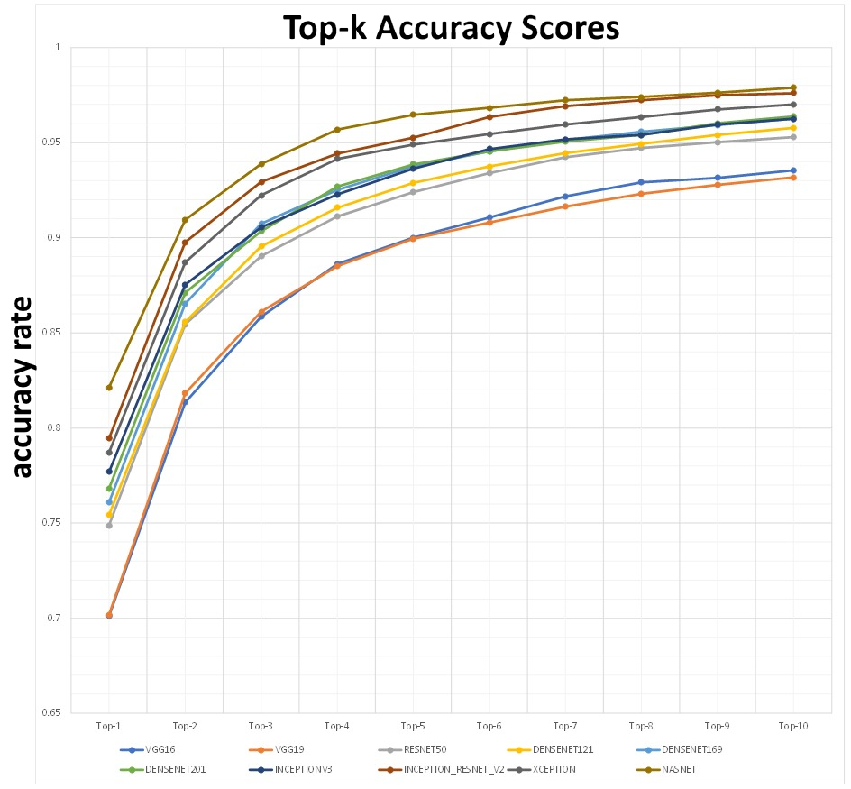

# Artificial Intelligence (CS7IS2) Assignment 2 Repository

<h1>Topic: Benchmarking State-of-The-Art Image Recognition techniques for image classification</h1>>

	A subset of size = 3500 images was taken from the validation set of the ImageNet 2012 challenge. Pre-trained models from the Keras module in TensorFlow were used to make predictions on the input data. The top-k accuracy for k in range[1,10] were recorded and analysed for all models used in the experiment.

>

	#Components:  
	<1> Data_PreProcessing.ipynb : Data preprocessing script  
	<2> Benchmark_Keras.ipynb : BenchMaeking Logic  

>

	#Prerequisites:  
	<1> All the data files in 'imagenet_validation_meta_data' folder  
	<2> 3500 from ImageNet dataset 
	<3> All these files must be copied to appropriate file-paths, as used in the .ipynb scripts
		The image-label mapping logic may needs to be changed depending on the images used 

>

<h1>Results</h1>

| .                   | Top-1 | Top-2 | Top-3 | Top-4 | Top-5 | Top-6 | Top-7 | Top-8 | Top-9 | Top-10 | 
|---------------------|-------|-------|-------|-------|-------|-------|-------|-------|-------|--------| 
| VGG16               | 0.7   | 0.81  | 0.86  | 0.89  | 0.9   | 0.91  | 0.92  | 0.93  | 0.93  | 0.94   | 
| VGG19               | 0.7   | 0.82  | 0.86  | 0.89  | 0.9   | 0.91  | 0.92  | 0.92  | 0.93  | 0.93   | 
| RESNET50            | 0.75  | 0.85  | 0.89  | 0.91  | 0.92  | 0.93  | 0.94  | 0.95  | 0.95  | 0.95   | 
| DENSENET121         | 0.75  | 0.86  | 0.9   | 0.92  | 0.93  | 0.94  | 0.94  | 0.95  | 0.95  | 0.96   | 
| DENSENET169         | 0.76  | 0.87  | 0.91  | 0.93  | 0.94  | 0.95  | 0.95  | 0.96  | 0.96  | 0.96   | 
| DENSENET201         | 0.77  | 0.87  | 0.9   | 0.93  | 0.94  | 0.95  | 0.95  | 0.95  | 0.96  | 0.96   | 
| INCEPTIONV3         | 0.78  | 0.88  | 0.91  | 0.92  | 0.94  | 0.95  | 0.95  | 0.95  | 0.96  | 0.96   | 
| INCEPTION_RESNET_V2 | 0.79  | 0.9   | 0.93  | 0.94  | 0.95  | 0.96  | 0.97  | 0.97  | 0.97  | 0.98   | 
| XCEPTION            | 0.79  | 0.89  | 0.92  | 0.94  | 0.95  | 0.95  | 0.96  | 0.96  | 0.97  | 0.97   | 
| NASNET              | 0.82  | 0.91  | 0.94  | 0.96  | 0.96  | 0.97  | 0.97  | 0.97  | 0.98  | 0.98   | 

